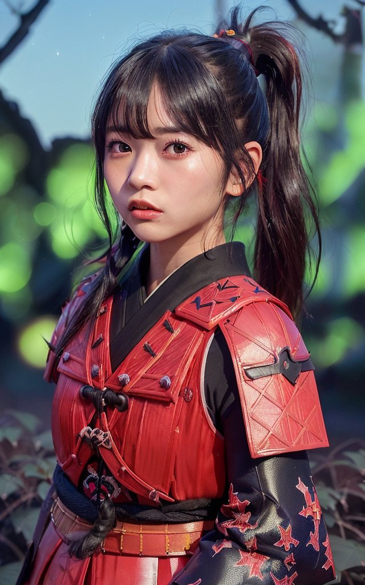
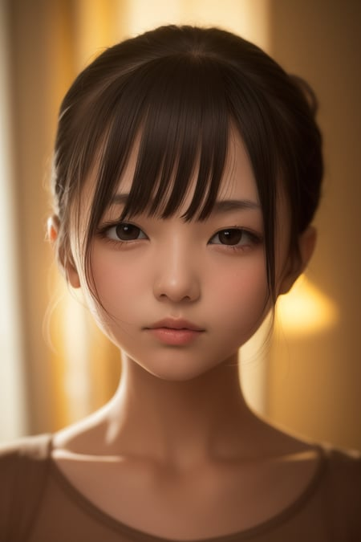
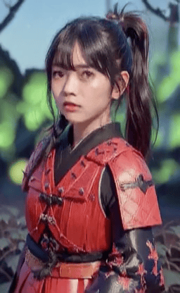
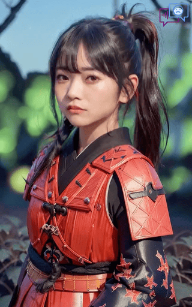

# Best Practice and Tips for configuration

> Our model only works on REAL person's photo or the portrait image similar to REAL person. The anime talking head genreation method will be released in future.

Advanced confiurations for `inference.py`:

| Name        | Configuration | default |   Explaination  | 
|:------------- |:------------- |:----- | :------------- |
| Enhance Mode | `--enhancer` | None | Using `gfpgan` or `RestoreFormer` to enhance the generated face via face restoration network 
| Background Enhancer | `--background_enhancer` | None | Using `realesrgan` to enhance the full video. 
| Still Mode   | ` --still` | False |  Using the same pose parameters as the original image, fewer head motion.
| Expressive Mode | `--expression_scale` | 1.0 | a larger value will make the expression motion stronger.
| save path | `--result_dir` |`./results` | The file will be save in the newer location.
| preprocess | `--preprocess` | `crop` | Run and produce the results in the croped input image. Other choices: `resize`, where the images will be resized to the specific resolution. `full` Run the full image animation, use with `--still` to get better results.
| ref Mode (eye) | `--ref_eyeblink` | None | A video path, where we borrow the eyeblink from this reference video to provide more natural eyebrow movement.
| ref Mode (pose) | `--ref_pose` | None | A video path, where we borrow the pose from the head reference video. 
| 3D Mode | `--face3dvis` | False | Need additional installation. More details to generate the 3d face can be founded [here](docs/face3d.md). 
| free-view Mode | `--input_yaw`,<br> `--input_pitch`,<br> `--input_roll` | None | Genearting novel view or free-view 4D talking head from a single image. More details can be founded [here](https://github.com/Winfredy/SadTalker#generating-4d-free-view-talking-examples-from-audio-and-a-single-image).


### About `--preprocess`

Our method automatically handle the input images via `crop`, `resize` and `full`.

 In `crop` mode, we only generate the croped image via the facial keypoints and generated the facial anime avator. The animation of both expression and head pose are realistic.

> still mode will stop the eyeblink and head pose movement.

|  [input image @bagbag1815](https://twitter.com/bagbag1815/status/1642754319094108161) | crop | crop w/still |
|:--------------------: |:--------------------: | :----: |
|  |  |  |


 In `resize` mode, we resize the whole images to generate the fully talking head video. Thus, an image similar to the ID photo can be produced. ⚠️ It will produce bad results for full person images.


 

|  |   |
|:--------------------: |:--------------------: |
| ❌ not suitable for resize mode | ✅ good for resize mode |
|  |   |

In `full` mode, our model will automatically process the croped region and paste back to the original image. Remember to use `--still` to keep the original head pose.

| input | `--still` | `--still` & `enhancer` |
|:--------------------: |:--------------------: | :--:|
|  |   |   


### About `--enhancer`

For better facial quality, we intergate [gfpgan](https://github.com/TencentARC/GFPGAN) and [real-esrgan](https://github.com/xinntao/Real-ESRGAN) for different purpose. Just adding `--enhancer <gfpgan or RestoreFormer>` or `--background_enhancer <realesrgan>` for the enhancement of the face and the full image.

```bash
# make sure above packages are available:
pip install gfpgan
pip install realesrgan
```

### About `--face3dvis`

This flag indicate that we can generated the 3d-rendered face and it's 3d facial landmarks. More details can be founded [here](face3d.md).

| Input        | Animated 3d face | 
|:-------------: | :-------------: |
|   | <video src="https://user-images.githubusercontent.com/4397546/226856847-5a6a0a4d-a5ec-49e2-9b05-3206db65e8e3.mp4"></video>  | 

> Kindly ensure to activate the audio as the default audio playing is incompatible with GitHub.


#### reference eye-link mode.

| Input, w/ reference video   ,  reference video    | 
|:-------------: | 
|  | 
| If the reference video is shorter than the input audio, we will loop the reference video . 


#### Generating 4D free-view talking examples from audio and a single image

We use `input_yaw`, `input_pitch`, `input_roll` to control head pose. For example, `--input_yaw -20 30 10` means the input head yaw degree changes from -20 to 30 and then changes from 30 to 10.
```bash
python inference.py --driven_audio <audio.wav> \
                    --source_image <video.mp4 or picture.png> \
                    --result_dir <a file to store results> \
                    --input_yaw -20 30 10
```

| Results, Free-view results,  Novel view results  | 
|:-------------: | 
|  | 
